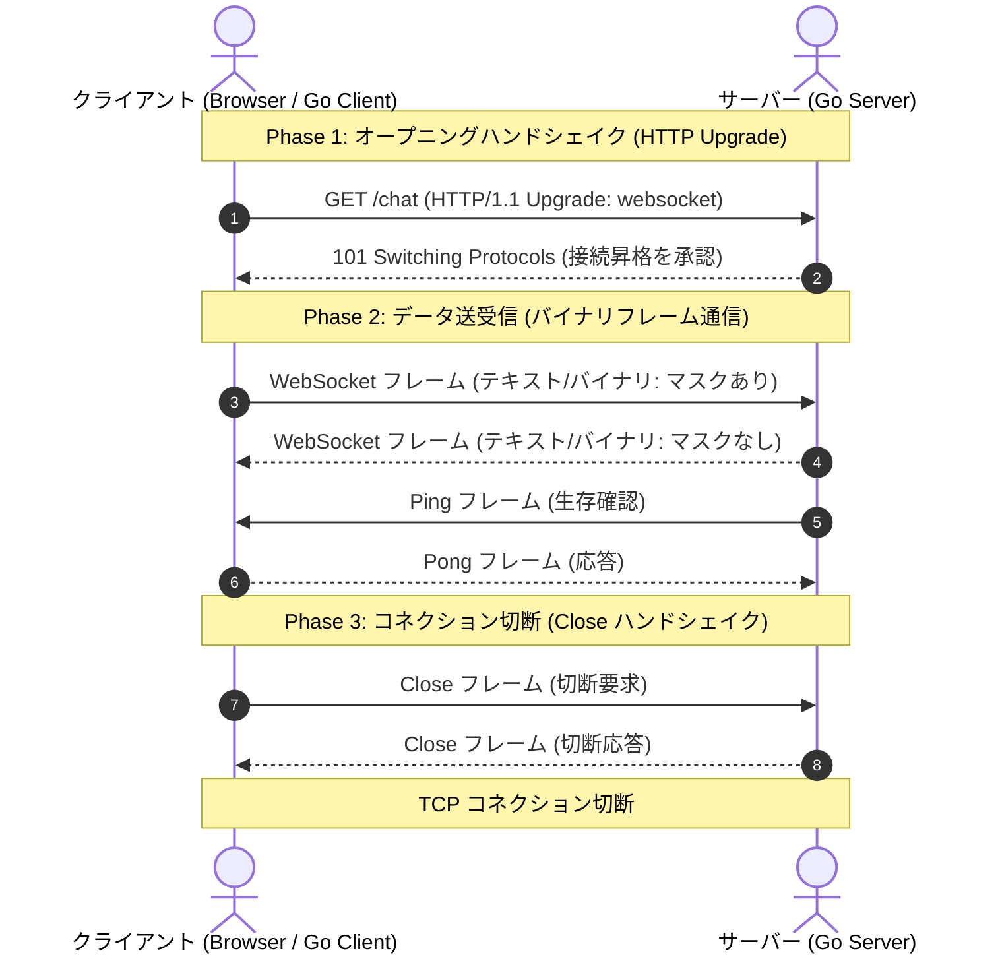

# WebSocket 入門ガイド & プロトコル解説

本書は、WebSocket の基本概念からプロトコルの詳細仕様（RFC 6455）、および生 TCP ソケットから実装する際に必要となる前提知識をわかりやすくまとめたドキュメントです。

---

## 1. WebSocket とは？

WebSocket は、**単一の長寿命 TCP コネクション上で、サーバーとクライアントが互いに任意のタイミングでデータを送信できる全二重双方向通信（Full-Duplex）プロトコル** です（2011年に [RFC 6455](https://datatracker.ietf.org/doc/html/rfc6455) として標準化）。

### 従来の HTTP との比較

| 項目 | 従来の HTTP (HTTP/1.1) | WebSocket |
| :--- | :--- | :--- |
| **通信方向** | 半二重（クライアントからの要求に対してサーバーが応答する「リクエスト/レスポンス」型） | **全二重**（双方がいつでも自由に送信可能） |
| **コネクション** | リクエストごとに切断またはキープアライブ再利用 | **常時接続**（一度繋いだら明示的に閉じるまで維持） |
| **ヘッダー負荷** | 毎リクエストで数百バイト〜数KBの HTTP ヘッダーが往復 | 最初のハンドシェイク以降は **わずか 2〜14 バイト** の軽量フレームヘッダーのみ |
| **リアルタイム性** | ポーリング（定期的問い合わせ）やロングポーリングが必要 | サーバーでイベントが発生した瞬間に **即座にプッシュ配信** 可能 |
| **主な用途** | Webページの取得、REST API | チャット、通知、共同編集、オンライン対戦ゲーム、株価・為替レートのリアルタイム配信 |

---

## 2. WebSocket 通信のライフサイクル

WebSocket 通信は大きく以下の 3 つのフェーズで進行します。



---

## 3. オープニングハンドシェイクの仕組み

WebSocket は、既存の HTTP ポート（80 / 443）やプロキシインフラとの親和性を保つため、**通常の HTTP リクエストとして接続を開始**します。

### 3.1 クライアントからの Upgrade リクエスト
クライアントは標準的な HTTP GET リクエストを送信しますが、ヘッダーにプロトコル昇格（Upgrade）の指示を含めます。

```http
GET /chat HTTP/1.1
Host: server.example.com
Upgrade: websocket
Connection: Upgrade
Sec-WebSocket-Key: dGhlIHNhbXBsZSBub25jZQ==
Sec-WebSocket-Version: 13
```

- **`Upgrade: websocket` / `Connection: Upgrade`**
  - 「この TCP 接続を HTTP から WebSocket プロトコルに昇格してほしい」という要求。
- **`Sec-WebSocket-Key`**
  - クライアントがランダムに生成した 16 バイトのバイナリを Base64 エンコードした文字列（24文字）。
- **`Sec-WebSocket-Version: 13`**
  - RFC 6455 準拠を示す固定値 `13`。

### 3.2 サーバーの計算とレスポンス (101 Switching Protocols)
サーバーは要求を受け入れる場合、`Sec-WebSocket-Key` を使って検証用トークン **`Sec-WebSocket-Accept`** を生成して返します。

```http
HTTP/1.1 101 Switching Protocols
Upgrade: websocket
Connection: Upgrade
Sec-WebSocket-Accept: s3pPLMBiTxaQ9kYGzzhZRbK+xOo=
```

#### `Sec-WebSocket-Accept` の計算手順
1. クライアントから受け取った `Sec-WebSocket-Key`（例: `"dGhlIHNhbXBsZSBub25jZQ=="`）の末尾に、仕様で定義された固定の **Magic String (`"258EAFA5-E914-47DA-95CA-C5AB0DC85B11"`)** を連結する。
   - `"dGhlIHNhbXBsZSBub25jZQ==258EAFA5-E914-47DA-95CA-C5AB0DC85B11"`
2. この文字列の **SHA-1 ハッシュ**（20バイト）を計算する。
3. そのハッシュ値を **Base64 エンコード** する。
   - 結果: `"s3pPLMBiTxaQ9kYGzzhZRbK+xOo="`

> [!NOTE]
> **なぜこのような計算をするのか？**
> 暗号化・認証目的ではなく、**「相手サーバーが WebSocket (RFC 6455) を正しく理解しているか」**、および **「中継するプロキシキャッシュが過去の通常 HTTP レスポンスを誤って返していないか」** をクライアントが確実に判定するための仕組みです。

クライアントは、受信したレスポンスの `Sec-WebSocket-Accept` が自身で計算した値と一致することを確認してハンドシェイクを完了します。ここから先は HTTP ではなく **WebSocket フレーム形式のバイナリ通信** に切り替わります。

---

## 4. WebSocket フレーム構造 (バイナリフォーマット)

ハンドシェイク完了後、メッセージはすべて **フレーム（Frame）** と呼ばれるバイナリパケットに分割・カプセル化されて送受信されます。

RFC 6455 Section 5.2 で定義されているフレームヘッダーの構造は以下の通りです：

```text
 0                   1                   2                   3
 0 1 2 3 4 5 6 7 8 9 0 1 2 3 4 5 6 7 8 9 0 1 2 3 4 5 6 7 8 9 0 1
+-+-+-+-+-------+-+-------------+-------------------------------+
|F|R|R|R| opcode|M| Payload len |    Extended payload length    |
|I|S|S|S|  (4)  |A|     (7)     |             (16/64)           |
|N|V|V|V|       |S|             |   (if payload len==126/127)   |
| |1|2|3|       |K|             |                               |
+-+-+-+-+-------+-+-------------+ - - - - - - - - - - - - - - - +
|     Extended payload length continued, if payload len == 127  |
+ - - - - - - - - - - - - - - - +-------------------------------+
|                               |Masking-key, if MASK set to 1  |
+-------------------------------+-------------------------------+
| Masking-key (continued)       |          Payload Data         |
+-------------------------------- - - - - - - - - - - - - - - - +
:                     Payload Data continued ...                :
+---------------------------------------------------------------+
```

### 各フィールドの詳細

#### 1. FIN (1 bit - 先頭バイトの最上位ビット)
- `1`: メッセージの最後のフレーム（単一フレームでメッセージが完結する場合も `1`）。
- `0`: 後続の分割フレーム（フラグメント）がある。

#### 2. RSV1, RSV2, RSV3 (各 1 bit)
- 拡張仕様（圧縮など）がない限り、すべて `0`。`0` 以外を受信した場合はエラー。

#### 3. Opcode (4 bits)
フレームのデータ種類を表します。
- `0x0`: Continuation (分割された後続フレーム)
- `0x1`: **Text フレーム** (UTF-8 文字列)
- `0x2`: **Binary フレーム** (任意の生バイナリデータ)
- `0x8`: **Close フレーム** (切断通知)
- `0x9`: **Ping フレーム** (生存確認)
- `0xA`: **Pong フレーム** (Ping に対する応答)

#### 4. MASK (1 bit - 2バイト目の最上位ビット)
- `1`: ペイロードデータがマスクされている。
- `0`: マスクされていない。
> [!IMPORTANT]
> **RFC 6455 の厳格なルール:**
> - **クライアントからサーバーへ送信する場合:** 必ず `MASK=1` にし、4バイトのマスクキーを付与しなければならない。サーバーは `MASK=0` のフレームを受信した場合、接続を切断（プロトコルエラー）しなければなりません。
> - **サーバーからクライアントへ送信する場合:** 必ず `MASK=0` でなければならない。

#### 5. Payload length (7 bits / 可変長)
データサイズを効率的に表現するため、段階的なサイズ表現を採用しています。
- **0 〜 125:** その値がそのままペイロードのバイト長。ヘッダーは追加不要。
- **126:** 次の **2 バイト** (16-bit符号なし整数、ビッグエンディアン) を読み取り、その値がペイロード長となる（最大 65,535 バイト）。
- **127:** 次の **8 バイト** (64-bit符号なし整数、ビッグエンディアン) を読み取り、その値がペイロード長となる（最大約 18 エクサバイト）。

#### 6. Masking-key (4 bytes, MASK=1 の場合のみ存在)
クライアントが無作為に生成した 4 バイトのキー。

#### 7. Payload Data (実際のデータ本体)
送信する本文。MASK=1 の場合、以下の XOR 演算でマスクされています。
受信側は同じ XOR 演算を適用することで元の平文データを復元（アンマスク）できます：

$$\text{OriginalByte}[i] = \text{MaskedByte}[i] \oplus \text{MaskingKey}[i \pmod 4]$$

---

## 5. なぜクライアント側はマスク処理が必要なのか？

「暗号化したいなら TLS (WSS: WebSocket Secure) を使えば良いのに、なぜアプリケーション層でわざわざ XOR マスクをするのか？」と疑問に思うかもしれません。

これは **「キャッシュポイズニング（不正中継キャッシュ汚染）攻撃の防止」** が目的です。

### 攻撃シナリオ（マスクが無い場合）
1. 悪意ある Web サイト上の JavaScript が WebSocket クライアントを使い、意図的に「HTTP GET /login.html HTTP/1.1 ...」のような偽の HTTP リクエスト文字列を WebSocket データとして送信する。
2. 透過型プロキシ（WebSocket を解釈できない古い中継機器）が途中に介在していると、その生データを「正規の HTTP リクエスト」と誤認してしまう。
3. プロキシが偽のリクエストをキャッシュし、他の善良なユーザーに偽のレスポンスを返してしまう。

### マスクによる対策
クライアントから送信されるすべてのバイトをランダムな 4 バイトのキーで XOR 変換することで、ワイヤ上を流れるバイト列を完全に予測不可能なランダム値にします。これにより、透過型プロキシが HTTP 電文として誤認識する事故を確実に防いでいます。

---

## 6. 接続の維持と切断

### 6.1 Ping / Pong (キープアライブ)
- TCP コネクションは長時間通信がないと、途中のルーターや NAT、ファイアウォールによって無言で切断（タイムアウト）されることがあります。
- これを防ぐため、定期的に **Ping (0x9)** フレームを送信し、相手が **Pong (0xA)** フレームを即座に同じペイロードで送り返すことで、生存確認と接続維持を行います。

### 6.2 クローズハンドシェイク (Graceful Close)
接続を終了する際、いきなり TCP ソケットを閉じるのではなく、双方が合意して切断します。
1. 一方が **Close フレーム (0x8)** を送信する（ペイロードに 2 バイトのステータスコードを含める。例: `1000` = 正常終了）。
2. 受信側も確認として **Close フレーム (0x8)** を送り返す。
3. その後、TCP コネクション（`net.Conn`）を `Close()` する。

---

## 7. 生 TCP から実装する全体像 (Go 言語)

今回のプロジェクトではサードパーティライブラリを使わず、以下のように Go の標準ライブラリのみで組み立てます。

```text
[生 TCP 接続 (net.Conn)]
        │
        ├── (1) 接続直後: bufio.Reader で HTTP ヘッダーを 1 行ずつ読み込み
        │       └─ Sec-WebSocket-Key を抽出し、101 Switching Protocols を書き込む
        │
        └── (2) ハンドシェイク完了後: net.Conn から生バイト列を読み取り
                ├─ 最初の 2 バイトをビット演算 (>>, &) してヘッダー解析
                ├─ 拡張ペイロード長 (binary.BigEndian) を読み取り
                ├─ マスクキー (4 bytes) を読み取り
                ├─ 残りのペイロードを読み取り、XOR 演算でデコード
                └─ 読み取ったメッセージを処理（エコー返信、Ping/Pong 処理）
```

WebSocket は一見複雑に見えますが、本質は **「HTTP で開始し、合意後にビット単位でパッキングされた独自フレームを TCP でやり取りする」** という非常に洗練されたプロトコルです。
